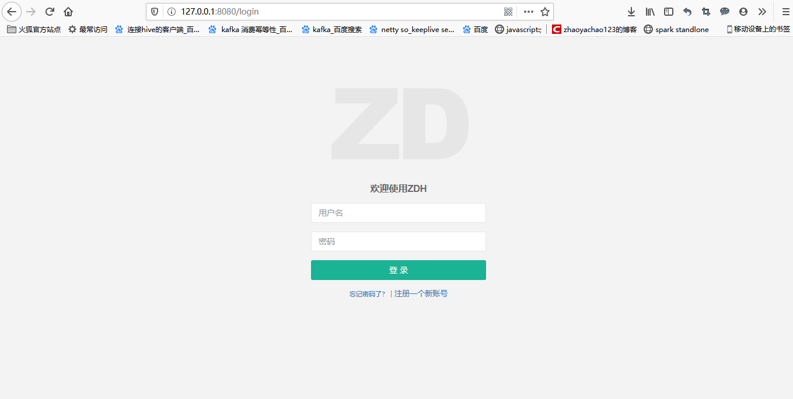
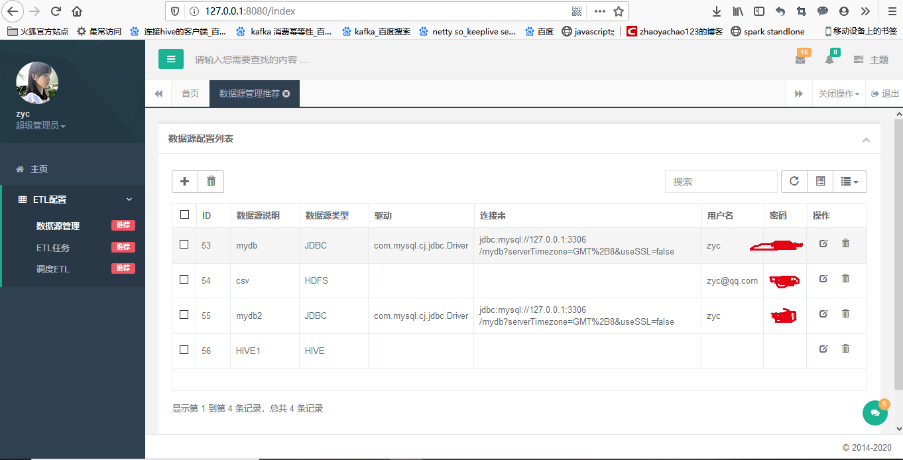
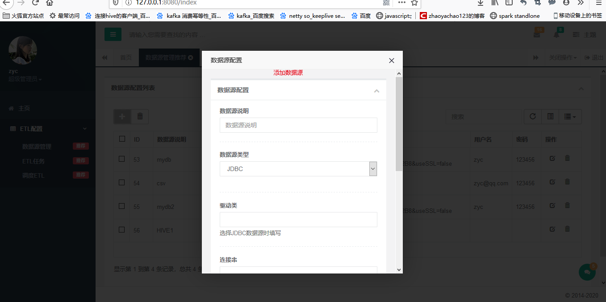
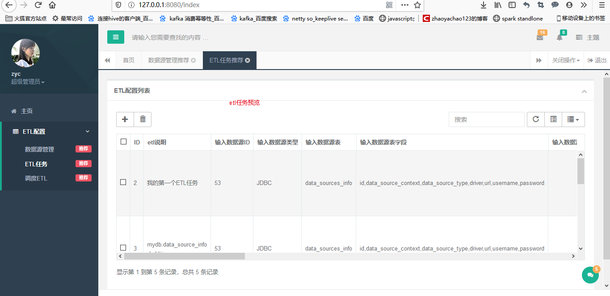
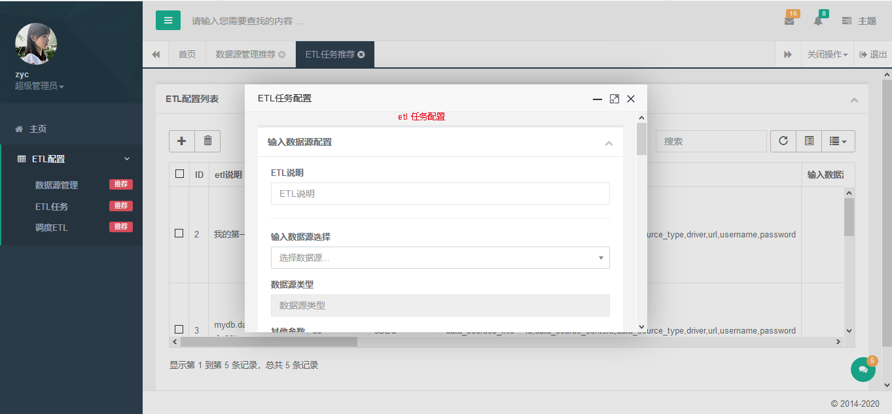
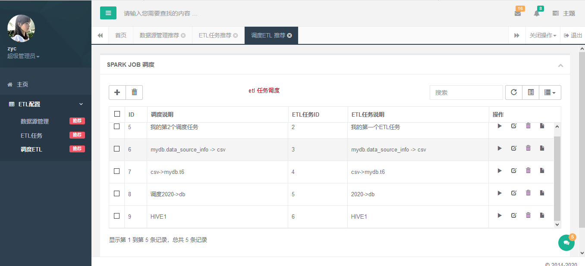
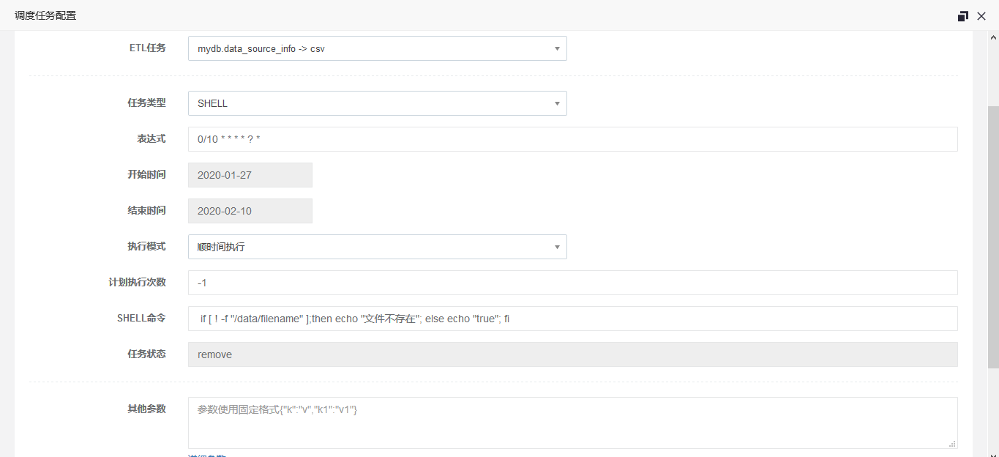

# 特色
    开箱即用
    支持多数据源
    单独的调度器,调度也可和三方调度器对接airflow,azkaban
    二次开发
   
    
# 主要功能
 zdh 主要的作用 是从hdfs,hive,jdbc 等数据源拉取数据,并转存到hdfs,hive,jdbc等其他数据源
 支持集群式部署
 
 
  + 支持sql标准函数
  + 支持界面选择配置
  + 支持外部调度工具(需要修改,新增特定接口)
  + 弹性扩展(可单机,可集群)
  + 支持客户级权限
  + 简单易用支持二次开发
  + 自带简单调度工具,可配置定时任务,时间序列任务,设定次数
  + 支持SHELL 命令检查文件 if [ ! -f "/dir1/file1" ];then echo "文件不存在"; else echo "true"; fi
 
 # 支持的数据源
   + hive
   + hdfs
   + jdbc (所有的jdbc,包含特殊jdbc如hbase-phoenix,spark-jdbc)
   + hbase
   + kafka(暂未支持)

# 支持的调度对象
   + shell 命令
   + 数据库查询
   + 特色开发jar
   
# 支持的调度器模式
   + 时间序列(时间限制,次数限制)
   + 单次执行
   + 重复执行(次数限制,时间限制)
   
# 支持调度动态日期参数   
   
 
# 用到的技术体系

    前端：Bootstrap
    后端：Springboot+shiro+redis+mybatis
    数据ETL引擎:Spark(hadoop,hive 可选择部署)
    
# 下载修改基础配置

    打开resources/application-dev.properties
     1 修改服务器端口默认8080
     2 修改数据源连接(默认支持mysql8),外部数据库必须引入
     3 修改redis配置

    创建需要的数据库配置
     1 执行sql脚本db.sql
     
    依赖
     1 必须提前安装redis 

# 打包
    
    清理命令 mvn clean
    打包命令 mvn package -Dmaven.test.skip=true

# 运行
    在target 目录下找到zdh.jar
    执行 java  -Dfile.encoding=utf-8 -jar zdh.jar
   
# 版本计划
  + 1.1 计划支持FTP 调度
  + 1.1 增加任务复制功能-快速配置任务
  + 1.1 docker 部署   
    

# 提示
   
    zdh 分2部分,前端配置+后端数据ETL处理,此部分只包含前端配置,有意者联系1299898281@qq.com
   
   

   
# 界面预览   

 
 